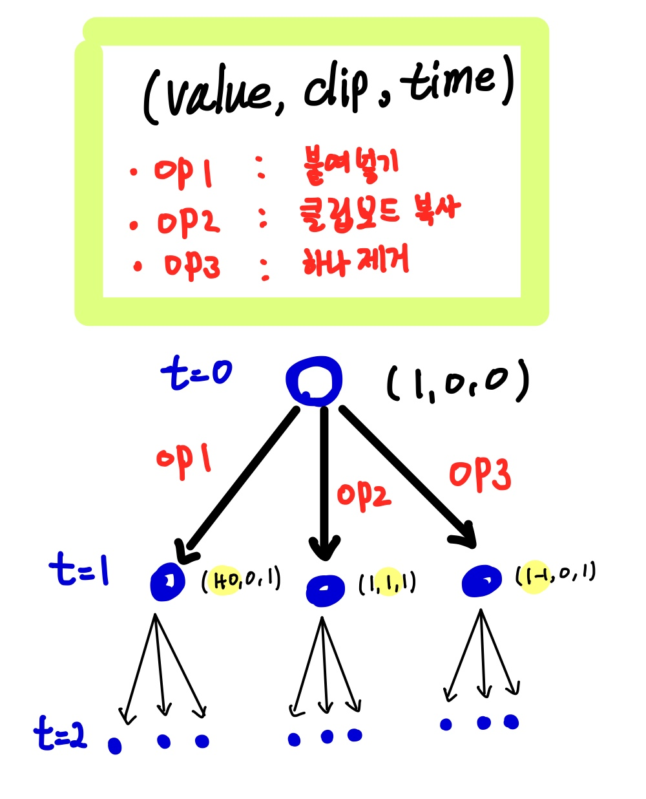
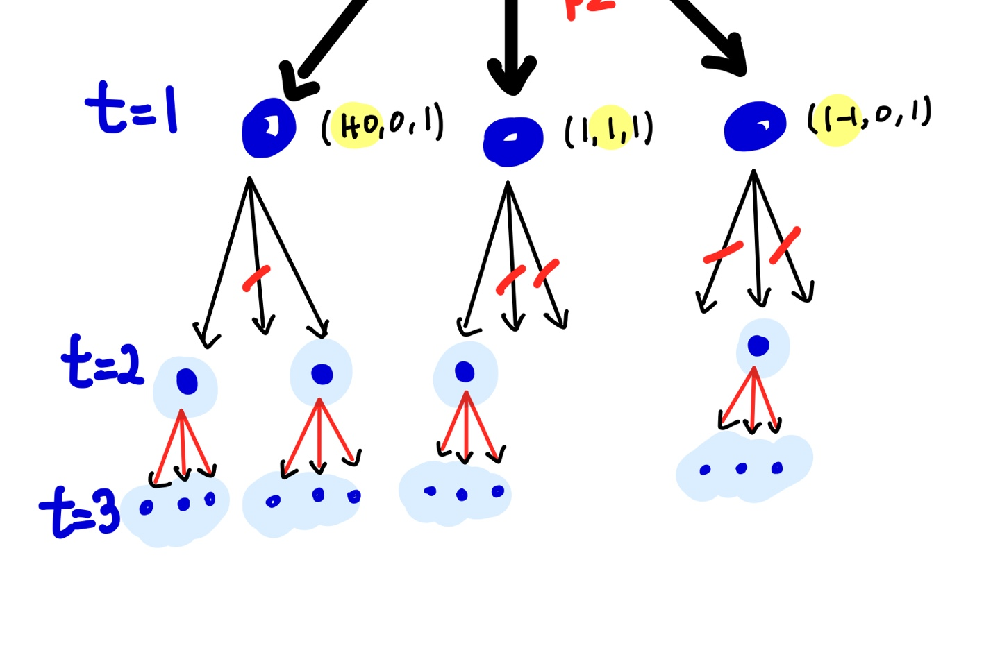

# 이모티콘 

## 문제해석

1. 초기상태로 화면에 1개의 이모티콘이 있다. 
2. 3가지 연산이 가능하다. 
   1. 화면의 이모티콘 모두를 클립보드에 복사 후 덮어쓰기
   2. 클립보드의 이모티콘을 화면에 붙여넣기
   3. 화면의 이모티콘을 하나 제거하기 
3. `N`개의 이모티콘을 화면에 남기기 위한 최소한의 연산 수를 구하는 문제

## Key word

* 경우의 수
* 동적할당(?)
* 백트래킹

## 풀이 접근

경우의 수를 구하는 문제이므로, BFS로 경우의 수 트리를 탐색하는 문제로 생각한다. 



모든 경우를 탐색하게 된다면, 시간 또는 메모리 초과가 나기 때문에 BackTracking으로 고려하지 않아도 되는 경우라면 빠르게 포기한다. 





## Solution

### Try 1 


```python
from collections import deque 

def bfs(target):
    queue = deque([(1,0,0)])
    visited = [False for i in range(target*2+1)]
    stacked = [False for i in range(target*2+1)]
    while True :
        value, clip, time = queue.popleft()
        if value == target:
            return time 
        else:
            queue.append((value+clip, clip, time+1))
            queue.append((value, value, time+1))
            queue.append((value-1, clip, time+1)
```


### Try 2 

```python
from collections import deque 

def bfs(target):
    queue = deque([(1,0,0)])
    visited = [False for i in range(target*2+1)]
    stacked = [False for i in range(target*2+1)]
    while True :
        value, clip, time = queue.popleft()
        visited[value] = True
        if value == target:
            return time 
        else:
            if value+clip<target*2 and not visited[value+clip] :
                queue.append((value+clip, clip, time+1))
            if not stacked[value]:
                queue.append((value, value, time+1))
                stacked[value] =True
            if value>1 and not visited[value-1]:
                queue.append((value-1, clip, time+1))

N = int(input())
print(bfs(N))
```

## References 
[1] https://www.acmicpc.net/problem/14226