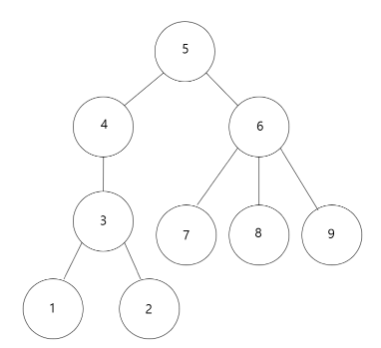

# 트리와 쿼리


Graph가 주어졌을 때, 한 정점`N`에 대해서 Tree를 만든다면, 
해당 트리의 노드 `K`에서 생기는 서브트리의 정점의 수를 구하는 문제이다. 




## 풀이

1. Sparse한 구조로 그래프를 만든다. 
2. Graph를 Tree구조로 바꾼다. (단방향) 
3. 정점 `K`에서 트리를 Recursive 하게 탐색한다.

상위 Subtree와 하위 Subtree에 대해서는 다음과 같은 공식이 성립한다. 

```python
SubSize(K) = 1 + sum([SubSize(child) for child in Tree[K]]) 
```

좀더 자세하게 나타내면, Leaf Node에서는 1을 반환하고, Leaf노드가 아니라면, 하위 노드들에 대한 Subgraph의 크기 + 1 로 구현하면 된다. 

```python
dp = [0 for i in range(N+1)]
def recursive_dp(node):
    if len(tree[node])==0:
        dp[node]=1
        return 1 
    if dp[node] !=0:
        return dp[node]
    cumm = 1
    for nei in tree[node]:
        cumm += recursive_dp(nei)
    dp[node] = cumm
    return cumm

```


