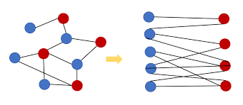
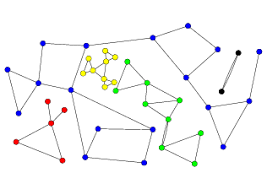

# 이분 그래프 

그래프가 주어졌을 때, 이분 그래프(Bipartite Graph)의 여부를 확인하는 문제이다. 
이분 그래프는, 그래프를 서로 연결되지 않은 두 부분으로 나눌 수 있을 때, 이분 그래프라고 한다. 




## 이론적 풀이

2-coloring algorithm을 적용해서, 만일 색칠 가능하다면, 그래프는 이분 그래프이다. 

```
1. A, B 두 개의 Color가 있다. 
2. 한 노드에서 A를 칠한다. 
3. 이웃한 노드에서 B를 칠한다. 
4. 이웃 노드를 방문한다. 
5. 해당 노드의 이웃 노드에 다른 색깔을 칠한다. 
6. 모든 노드를 칠할 때까지 반복. 

```

## 실제 풀이

단순하게 BFS로 그래프를 탐색하면 몇 가지 문제점이 존재한다. 

1. 그래프의 Component가 1개가 아닐 수 있다. 따라서 색칠되지 않은 노드가 있다면, 해당 노드에서 Search를 다시 시작해야 한다. 




2. 이분 그래프의 여부를 Coloring을 하고 있는 중간에 검토하는 것보다, 색칠을 완료하고 검토하는 것이 빠르다. 


3. 그래프의 구조. 

탐색을 하는데는 sparse한 구조가 edge를 보관하고 있는 구조보다 용이하다. 

반대로 색칠을 완료하고 이분 그래프의 여부를 확인하는데는 일차원 리스트의 형태가 편하다. 

(물론 sparse 구조도 이중 for문으로 똑같이 작동가능. )

```python
# Sparse
graph = {
    1 : [2,3]
    2 : [3]
}

graph = [(1,2), (2,3), (1,3)]
```

4. 색깔

```1, -1```을 이용하면, 색깔을 쉽게 반전시킬 수 있다. 

## Solution 


```python
import sys 

def canBipartite(graph, graph_linear, n):
    colors = [0 for i in range(n)]
    for v in range(n):
        if colors[v]==0:
            queue = [v]
            colors[v] = 1
            while queue:
                v = queue.pop(0)
                color = colors[v]
                for nei in graph[v]:
                    if colors[nei]==0:
                        colors[nei] = -color
                        queue.append(nei)

    for a,b in graph_linear:
        if colors[a] == colors[b]:
            return False
    return True

T = int(input())
for _ in range(T):
    v, e = map(int, map(int, sys.stdin.readline().strip().split()))
    graph = {i:[] for i in range(v)} # Construct Graph
    graph_linear = [] # Additional store, see (3)
    for i in range(e):
        a,b = map(int, map(int, sys.stdin.readline().strip().split()))
        graph[a-1].append(b-1)
        graph[b-1].append(a-1)
        graph_linear.append((a-1,b-1))
    if canBipartite(graph, graph_linear, v):
        print("YES")
    else:
        print("NO")
```


## References 

[1] 그래프 Coloring https://en.wikipedia.org/wiki/Graph_coloring

[2] Problem Link  https://www.acmicpc.net/problem/1707